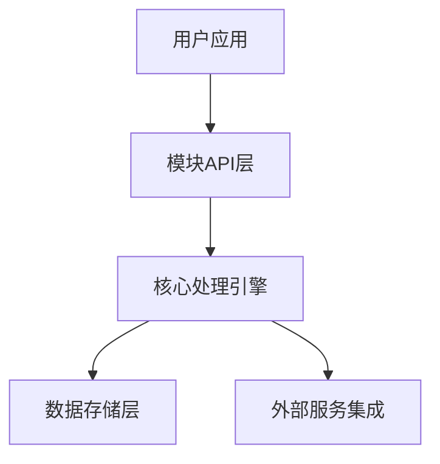

# 介绍

## 关于此模块

这是一个功能强大的模块，旨在解决特定领域的问题。本文档将帮助您了解如何使用该模块，以及如何充分利用其所有功能。

## 主要特性

- **特性一**: 高性能、低延迟的数据处理
- **特性二**: 简单易用的API接口
- **特性三**: 完全可定制的配置选项
- **特性四**: 全面的错误处理机制

## 为什么选择我们的模块

我们的模块在设计时考虑了性能和易用性。与市场上的其他解决方案相比，我们提供了更好的性能指标和更简洁的API。

## 技术架构

## 下一步

- [快速开始](/guide/getting-started) - 5分钟内上手使用
- [基本用法](/guide/basic-usage) - 了解基础功能
- [高级功能](/guide/advanced) - 探索高级特性 